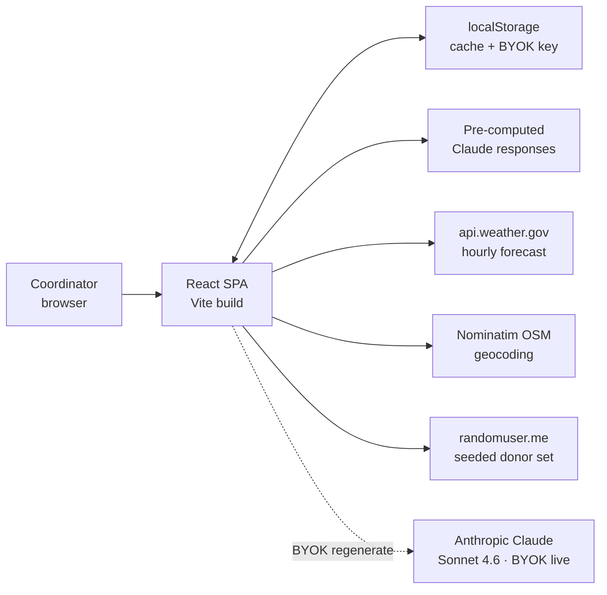

# System Design — Blood Drive Coordinator Copilot

**Author:** Test Kitchen (Phase 2 agent, human-reviewed)
**Upstream:** `01-prd.md` (v3), `01b-assumption-map.md`

## 1. Architecture at a glance



The runtime is a static React SPA. External APIs are called browser-side. LLM output is pre-computed at build time and served as canned responses; a BYOK "regenerate live" path lets an interviewer point at their own Anthropic key to see live inference. There is no backend and no shared state.

## 2. Data model

```ts
Drive       { id, name, addr, lat(R), lng(R), date, target_units(R), slots: Slot[] }
Slot        { time, donor_id? }
Donor       { id, name, phone, email, blood_type, first_time, past_no_shows,
              distance_mi, last_donation, confirmed_at? }
Forecast    { hour, temp_f, precip_pct, condition }  // from NWS
RiskScore   (D) { donor_id, score_0_100, tier: 'High'|'Med'|'Low',
                  top_factors: string[], recommended_action }
SMSDraft    (D) { donor_id, text, char_count, tone_tags: string[],
                  source: 'canned'|'live', generated_at }
DriveOutcome (post-drive) { drive_id, predicted_no_shows,
                            actual_no_shows, delta_by_factor }
```

R = required, D = derived. All entities live in-memory; seed data ships in `src/data/seed.ts`.

## 3. External API integrations

| API | Purpose | Auth | Rate limit | CORS | Endpoint |
|-----|---------|------|-----------|------|----------|
| **[NWS `api.weather.gov`](https://www.weather.gov/documentation/services-web-api)** | Hourly forecast for drive site | None (User-Agent required) | Fair use (~40 req/min) | ✅ | `POST /points/{lat},{lng}` → `GET /gridpoints/.../forecast/hourly` |
| **[Nominatim OSM](https://nominatim.org/release-docs/latest/api/Search/)** | Geocode drive address → lat/lng | None | 1 req/sec fair use | ✅ | `GET /search?q={address}&format=json` |
| **[randomuser.me](https://randomuser.me/documentation)** | Seeded synthetic donor roster | None | ~10 req/sec | ✅ | `GET /api/?seed=redcross&results=30&nat=us` |
| **[Anthropic Messages API](https://docs.claude.com/en/api/messages)** | LLM narration + SMS drafting (BYOK live path only) | User-supplied key | Tier limits | ✅ | `POST /v1/messages` |

Every API is CORS-friendly and browser-callable. NWS is a 2-step handshake (points endpoint returns forecast URL) — must be cached in localStorage to survive the 429 storm during a demo.

## 4. LLM strategy

- **Model:** Claude Sonnet 4.6 (`claude-sonnet-4-6`). Chosen for output quality on short, structured generation with prompt caching.
- **Default path — pre-computed canned responses.** The Phase 5 build agent runs Claude at build time for every interactive click path (1 Morning Brief × 3 weather variants, 30 donor SMS drafts, 5 risk-factor explanations) and writes results to `src/data/canned-llm.ts`. At runtime, click → lookup → serve. Deterministic, zero-cost, real Claude quality.
- **Live path — BYOK regenerate.** Every LLM-generated card has a "Regenerate live" button. Opens a modal, accepts an Anthropic API key (stored in `localStorage`, never transmitted anywhere but Anthropic), runs the actual call, replaces the canned response with the live one.
- **Prompt structure:** system prompt (role, tone, safety contract, output format) + user prompt (compact structured JSON: donor context + weather + risk factors + task). System is authored to exceed the 1024-token cache threshold on Sonnet.
- **Prompt caching:** system prompt cached. Expected 90%+ cache hit within a session after first call.
- **Safety:** never claim medical or eligibility authority; never generate advice about donor health; refuse questions about the donor's medical status. Output-format contract enforced via prompt so the UI can render tone chips.
- **Cost estimate:** ~1500-token system (cached after first call) + ~500-token user + ~200-token output = ~$0.006 per call at cache hit. 50 calls per interviewer visit = ~$0.30 in live mode. Default path: $0.
- **Failure behavior:** live-path 429 or malformed output → fall back to the canned response for that interaction with a small "live regeneration failed, showing baseline" toast.

## 5. Rule-based logic (non-LLM)

*Rules for numbers, LLM for language.* The risk score is deterministic, not model-generated. This is deliberately tied to assumption **A2** (coordinators trust scores when reasons are visible) and **A14** (avoid disparate outreach) — rule-based scoring is auditable in a way an LLM score is not.

Scoring model (starting weights, revisable in pilot):
- Base rate: 20%
- +15 if first-time donor
- +10 if precipitation > 40% during appointment window
- +8 if precipitation during commute hour (±60 min)
- +12 per past no-show (cap at +24)
- +5 if extreme temperature (>90°F or <25°F)
- −8 if confirmed in last 24h
- −5 if returning donor (≥2 prior donations)

Score → tier: `High > 55`, `Med 35-55`, `Low < 35`. Top 3 contributing factors surfaced verbatim to the UI. LLM only *narrates* these factors — it does not compute them.

## 6. Runtime deployment

- Static site build; hostable on Vercel, Netlify, GitHub Pages, or Cloudflare Pages.
- No backend, no database, no server-side secrets.
- BYOK API key lives in browser `localStorage`; scope is that browser only.
- Environment variables: none required for the default (canned) path. Live path reads the key from localStorage.
- Workflow artifacts (`workflow/*.md`) copied to `public/workflow-artifacts/` at build time so the `/process` page can render them.

## 7. Risk section (tied to assumption map)

For each ⚠️ assumption from Phase 1.5, this design carries a specific decision or observability path:

- **A2 — Score trust hinges on visible reasons.** The RiskScore data model exposes `top_factors[]` as a first-class field; every risk badge in the UI must open a "why this score" panel citing those factors. If we ship without the panel we cannot test the assumption.
- **A4 — Weather signal materiality.** The scoring model isolates weather-driven components (precip, temp) into two named factors so we can compute their contribution and observe whether they correlate with observed no-shows in pilot data.
- **A1 — Coordinators check phone during downtime.** Mobile-first responsive layout; all screens usable on a phone browser. If pilot observation invalidates this, the copilot pivots to morning-prep-only.
- **A14 — Disparate outreach across donor cohorts.** Scoring is rule-based (not black-box ML) so features are auditable pre-pilot. UI never surfaces demographic factors as reasons. Post-drive recap includes attendance disaggregated by first-time flag so a coordinator can spot pattern early.
- **A3 — Personalized SMS lift.** Every SMS Draft carries a `source` tag so pilot A/B analysis can distinguish generic vs. personalized outreach at the cohort level.

## 8. Alternatives rejected

- **Server-backed API with authenticated coordinators.** Rejected — POC scope, adds compliance work without changing what we're testing. Revisit for v1.
- **Server-side Anthropic key with rate-limited proxy.** Rejected — cost and abuse risk on a public URL without meaningfully changing the demo story. Canned responses are real Claude output; BYOK covers the "prove it's live" moment.
- **ML-based no-show scoring.** Rejected — assumption A2 says visible reasons matter more than accuracy at this scale; a rule-based model is easier to defend, audit for disparate impact, and iterate on. Revisit only if H2/H5 validate strongly in pilot and we have enough historical data to justify a model.

## 9. Screens to wireframe (handoff to Phase 3)

- **Dashboard** — drive header, weather widget, AI Morning Brief card, sortable donor roster. Landing screen.
- **Donor Detail** — donor context, risk score with "why this score" factor breakdown, "Draft SMS" CTA.
- **SMS Composer** — LLM-drafted message editor, tone chips, "Regenerate live" (BYOK) action, "Mock send".
- **Post-Drive Recap** — predicted vs. actual, factor accuracy, disaggregated attendance, one-line learnings.
- **BYOK Modal** — Anthropic key entry, localStorage-only storage, clear "your key, your browser" language.
- **/process (meta-route)** — animated visualizations of the 5-phase workflow + expandable phase cards rendering `workflow/*.md`.

Each screen must have loading, empty, and error states designed alongside the happy path. Mobile responsiveness is a design constraint, not a follow-up.
