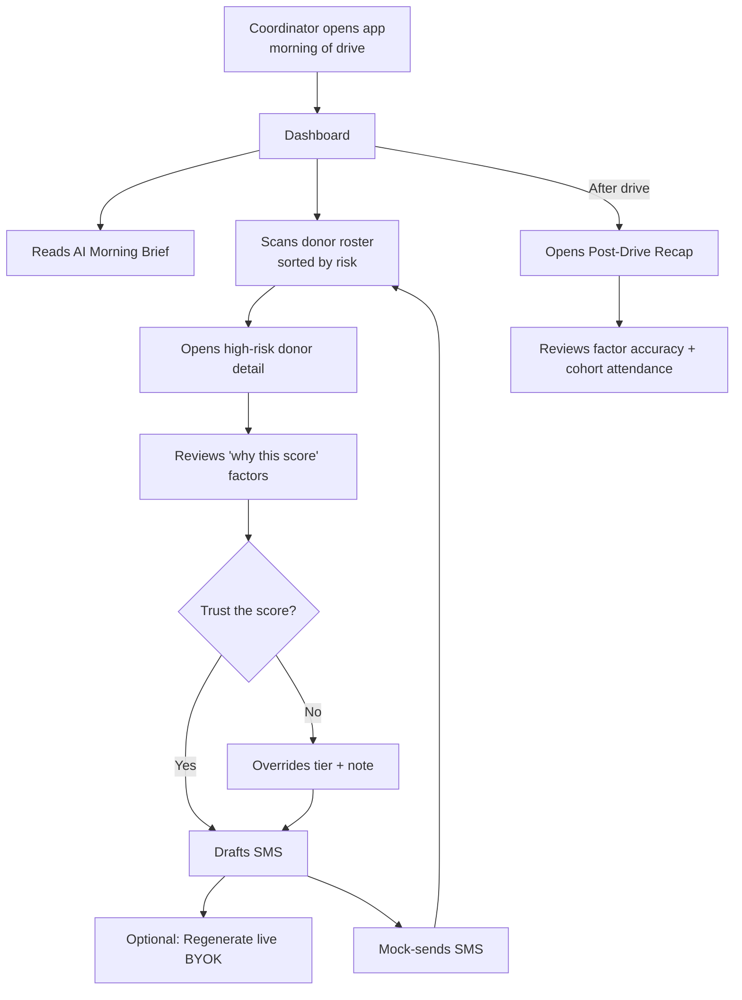

# Wireframes — Blood Drive Coordinator Copilot

**Author:** Test Kitchen (Phase 3 agent, human-reviewed)
**Upstream:** `01-prd.md` (v3), `01b-assumption-map.md`, `02-system-design.md`

## User flow



## Screen inventory

---

### Screen: Dashboard
**Route:** `/`
**User goal:** In one glance, know what's risky about today's drive and where to focus outreach.
**Primary action:** Open a high-risk donor's detail.

**Wireframe (default state, desktop ≥1024w):**
```
+---------------------------------------------------------------------+
| Coordinator Copilot        [Product] [How it was built]  [BYOK ⚙]  |
+---------------------------------------------------------------------+
| Johnstown HS · Blood Drive                                          |
| Fri Nov 15 · target 42 units · 30 slots booked                      |
+---------------------------------------------------------------------+
|                                                                     |
| Weather                    AI Morning Brief                         |
| +----------------+         +-------------------------------------+  |
| | Mostly cloudy  |         | Rain arrives at 3pm during peak     |  |
| | 12p ☁ 15%      |         | slots. 8 first-timers scheduled     |  |
| | 3p ☔ 68%      |         | 3-5pm — consider moving them        |  |
| | 5p ☔ 45%      |         | earlier or overbooking by 4-6.      |  |
| | High 42°F      |         |                     [regenerate ⟳] |  |
| +----------------+         +-------------------------------------+  |
|                                                                     |
| Donor roster    [Sort ▼ Risk]  [Filter ▼ All]      12 HIGH · 11 MED |
| +-----------------------------------------------------------------+ |
| | ● HIGH  Sarah T.    3:15p  first-time · rain              [→]  | |
| | ● HIGH  Marcus L.   3:45p  2 past no-shows · rain         [→]  | |
| | ● HIGH  Priya K.    4:00p  first-time · rain              [→]  | |
| | ● MED   Kevin M.    2:00p  first-time                     [→]  | |
| | ● MED   Alicia R.   4:30p  cold + first-time              [→]  | |
| | ● LOW   James H.    2:15p  returning · confirmed          [→]  | |
| | ...                                                             | |
| +-----------------------------------------------------------------+ |
|                                                                     |
|  [ View Post-Drive Recap → ]                                        |
+---------------------------------------------------------------------+
```

**Wireframe (mobile ≤640w):**
```
+-----------------------+
| Copilot   [☰] [BYOK] |
+-----------------------+
| Johnstown HS          |
| Fri Nov 15 · 42 units |
+-----------------------+
| ☔ Rain 3-5pm 68%     |
+-----------------------+
| AI Brief:             |
| Rain arrives at 3pm...|
|              [⟳]     |
+-----------------------+
| Roster · Sort: Risk ▼|
| ● HIGH Sarah T. 3:15p |
|   first-time · rain →|
| ● HIGH Marcus L. 3:45p|
|   2 no-shows · rain →|
| ● MED Kevin M. 2:00p  |
|   first-time         →|
| ...                   |
+-----------------------+
```

**Wireframe (loading state):**
```
+---------------------------------------------------------------------+
| Johnstown HS · Blood Drive                                          |
| Fri Nov 15 · target 42 units · 30 slots booked                      |
+---------------------------------------------------------------------+
| ▓▓▓▓▓▓▓▓ (weather shimmer)   ▓▓▓▓▓▓▓▓▓▓▓▓▓▓ (brief shimmer)         |
|                                                                     |
| Donor roster                                                        |
| ▓▓▓▓▓▓▓▓▓▓▓▓▓▓▓▓▓▓▓▓ (5 skeleton rows)                              |
+---------------------------------------------------------------------+
```

**Wireframe (empty state):**
```
+---------------------------------------------------------------------+
| No drive scheduled today.                                           |
|                                                                     |
|         [ Load sample drive (Johnstown HS) ]                        |
|                                                                     |
| (POC affordance — real coordinators would see their assigned drive) |
+---------------------------------------------------------------------+
```

**Wireframe (error state — weather fetch failed):**
```
+---------------------------------------------------------------------+
| ⚠ Live weather unavailable · showing cached forecast from 6h ago    |
|                                              [ Try again ]          |
| [ ... rest of dashboard renders with cached data ... ]              |
+---------------------------------------------------------------------+
```

**Data on screen:**
- Drive name, address, date — source: seed
- Target units, slots booked — source: seed
- Weather (temp, condition, precip%) — source: NWS via `lib/api/weather.ts`, cached to localStorage
- AI Morning Brief text — source: canned LLM (default) / live BYOK
- Donor roster (name, slot, top-2 factor tags, risk tier) — source: seed donors + `lib/scoring.ts`

**Interactions:**
- Click roster row `[→]` → opens Donor Detail drawer (slides in from right on desktop, full-screen on mobile)
- Click Sort/Filter → dropdown menus
- Click `[regenerate ⟳]` on Morning Brief → BYOK modal if no key stored, else live LLM call
- Click `[BYOK ⚙]` in top-right → BYOK modal
- Click `[View Post-Drive Recap →]` → navigates within `/` view to Recap tab
- Nav to `[How it was built]` → routes to `/process`

**Notes / decisions:**
- Roster ordering defaults to `Risk descending` — the highest-value information for a coordinator's first 30 seconds.
- Factor tags on the roster row (e.g. `first-time · rain`) preview the "why this score" without opening detail — reduces clicks for the confident coordinator.
- Weather widget doubles as a "trust the rain callout" affordance — if forecast confidence is low, the widget shows a `~` before the number so coordinators know the SMS won't cite weather.
- Accessibility: entire roster row is a single button/link, arrow-key navigable. Risk tier communicated by color AND icon-shape AND label text.

---

### Screen: Donor Detail (drawer)
**Route:** `/#/donor/:id` (URL hash so mobile back-button works)
**User goal:** Understand why this donor is scored the way they are; decide whether to draft outreach.
**Primary action:** Draft SMS.

**Wireframe (default state):**
```
+-------------------------------------------------------------------+
| ← Back to roster                                            [x]  |
+-------------------------------------------------------------------+
|                                                                   |
| Sarah T.  ● HIGH RISK (72%)             [ Draft SMS → ]          |
| 3:15p slot · A+ · first-time donor                                |
| 4.2 mi from site · SMS-preferred                                  |
|                                                                   |
| ─── Why this score ──────────────────────────────────────────── |
|                                                                   |
| + First-time donor                                    +15         |
| + 3:15p slot · rain 68% forecast                      +10         |
| + Cold snap (37°F at slot time)                       +5          |
| ─ Confirmed within last 24h                     (not applied)     |
|                                                                   |
| Base 20 + 30 = 50 → tiered HIGH after uncertainty band            |
|                                                                   |
| ─── Coordinator override ────────────────────────────────────── |
|                                                                   |
| Current tier: HIGH                                                |
| [ Set MED ]  [ Set LOW ]                                          |
| Reason: [ Dropdown: I know this donor / donor confirmed / other ] |
| Note:   +---------------------------------------------------+   |
|         |                                                    |   |
|         |                                                    |   |
|         +---------------------------------------------------+   |
|         [ Save override ]                                         |
|                                                                   |
| ─── History ─────────────────────────────────────────────────── |
|                                                                   |
| No prior donations. First-time donor.                             |
|                                                                   |
+-------------------------------------------------------------------+
```

**Wireframe (loading state):**
```
| Sarah T. ▓▓▓▓▓ (score calculating)              [ Draft SMS ]    |
| ▓▓▓▓▓ (factor rows skeleton x3)                                   |
```

**Wireframe (error state — override save failed):**
```
| ⚠ Override didn't save — try again? [ Retry ]                     |
```

**Data on screen:**
- Donor name, blood type, slot, distance, preferred channel — seed
- Risk score + tier — derived (`lib/scoring.ts`)
- Factor breakdown — derived from scoring output
- Override history — from `CoordinatorOverride` (in-memory for POC)
- Donation history (count, last donation, deferrals) — seed

**Interactions:**
- Click `[Draft SMS →]` → opens SMS Composer drawer
- Click `[Set MED]`/`[Set LOW]` → active state on button, override form appears
- Type reason + note → `[Save override]` becomes active
- Click `[Save override]` → optimistic UI update, tier changes on roster row

**Notes / decisions:**
- Show factors that WERE applied AND factors that WEREN'T (like "confirmed" for a donor who hasn't confirmed). Absence is often as important as presence — supports A2 (trust hinges on complete reasons).
- Override changes the *tier*, not the raw score, keeping the score audit-able.
- Coordinator note is free-text, capped at 200 chars.
- Accessibility: focus lands on `[Draft SMS →]` when drawer opens; ESC closes.

---

### Screen: SMS Composer (drawer)
**Route:** `/#/compose/:donorId`
**User goal:** Review and personalize the AI-drafted message, then send.
**Primary action:** Send (mock).

**Wireframe (default state):**
```
+-------------------------------------------------------------------+
| Draft SMS for Sarah T.                                       [x] |
+-------------------------------------------------------------------+
|                                                                   |
| ● Personalized · 148 chars · Source: canned Claude                |
|                                                                   |
| +---------------------------------------------------------------+ |
| | Hi Sarah — quick note that rain is likely at your 3:15pm       | |
| | slot. If it helps, we've got open windows at 12 or 1pm.        | |
| | Otherwise see you at 3:15! — Red Cross Johnstown              | |
| +---------------------------------------------------------------+ |
|                                                                   |
| Tone: [ • Warm ] [ Direct ] [ Playful ]                          |
|                                                                   |
| Cited factors in this message:                                    |
|   ● rain forecast   ● slot time   ○ first-time (softened)         |
|                                                                   |
| [ Regenerate live (BYOK) ⟳ ]      [ Cancel ]  [ Send (mock) →  ] |
|                                                                   |
+-------------------------------------------------------------------+
```

**Wireframe (loading state — while LLM generates):**
```
| ▓▓▓▓▓▓▓▓▓▓▓▓▓▓▓▓▓▓▓▓ (message shimmer)                            |
| Generating personalized draft...                                  |
```

**Wireframe (error state — live regen failed):**
```
| ⚠ Live regeneration failed. Showing baseline draft.               |
| (Message text below remains editable)                             |
```

**Wireframe (success state — after Send mock):**
```
| ✓ SMS sent to Sarah T. (mock — nothing actually sent)             |
|                                                                   |
| Sarah's tier will update to CONFIRMED once she replies YES.       |
| (This is a mock — no real SMS gateway in POC)                     |
|                                                                   |
| [ Back to roster ]                                                |
```

**Data on screen:**
- Draft text — from `src/data/canned-llm.ts` keyed by donor id; or live LLM output
- Char count, tone tags, source — derived from the SMSDraft entity
- Cited factors — parsed from the draft or attached as metadata

**Interactions:**
- Click tone chip → regenerates canned draft variant matching tone
- Edit text area → char count updates; overrides tone chips
- Click `[Regenerate live]` → BYOK modal if no key, else live call replacing text
- Click `[Send (mock)]` → success state; roster row shows `SMS sent` badge

**Notes / decisions:**
- Draft is always editable — coordinator has final say (A2 trust).
- Cited-factors row makes the LLM's reasoning legible; supports A2 and A14 (no demographic factors ever surface here).
- "Send" is mock — but explicit UI signals this so no one thinks a real SMS went out.

---

### Screen: Post-Drive Recap
**Route:** `/#/recap`
**User goal:** Learn what worked, what didn't, and what to do differently next drive.
**Primary action:** Read the one-line lessons.

**Wireframe (default state):**
```
+-------------------------------------------------------------------+
| Post-drive recap · Johnstown HS · Fri Nov 15                      |
+-------------------------------------------------------------------+
|                                                                   |
| Target 42 units  ·  Collected 39  ·  93% attainment              |
| Predicted 8 no-shows  ·  Actual 6                                 |
|                                                                   |
| ─── Prediction accuracy by tier ─────────────────────────────── |
|                                                                   |
|           Predicted   Actual no-show                              |
| HIGH      12          3                                           |
| MED       11          2                                           |
| LOW        7          1                                           |
|                                                                   |
| ─── Factor accuracy ─────────────────────────────────────────── |
|                                                                   |
| ● first-time donor factor       validated                         |
| ● rain factor                   validated (2/2 rain donors no-show)|
| ● past no-show factor           over-weighted                     |
|                                                                   |
| ─── Cohort attendance ───────────────────────────────────────── |
|                                                                   |
| Campus       87%  (13/15)                                         |
| Workplace   100%  (10/10)                                         |
| Community    40%  (2/5)                                           |
| Mobile Unit  100%  (2/2)                                          |
|                                                                   |
| ─── One-line lessons ────────────────────────────────────────── |
|                                                                   |
| · Community-cohort attendance was low. Investigate transit access.|
| · Rain-cited SMS worked — 2/2 rain donors attended.               |
| · Coordinator overrode Kevin M. (LOW→MED); Kevin did no-show.     |
| · Past-no-show weight seems too heavy — tune down for next drive. |
|                                                                   |
+-------------------------------------------------------------------+
```

**Wireframe (empty state — drive not yet completed):**
```
| No completed drive yet.                                           |
| Recap unlocks after the drive is marked complete.                 |
```

**Data on screen:**
- Attainment %, predicted vs actual no-shows — derived from `DriveOutcome`
- Factor accuracy — computed from predicted vs actual per donor
- Cohort attendance — derived from `DriveOutcome` × `Donor.cohort_tags`
- One-line lessons — canned LLM output for POC

**Interactions:**
- Click any lesson → drills into supporting donor list (out of scope for v0, stub only)
- `[Back to today's drive]` returns to Dashboard

**Notes / decisions:**
- Cohort attendance is the A14 audit surface: if one cohort is systematically underserved, this is where a coordinator sees it.
- Factor-accuracy signals feed weight tuning — supports A16 (coordinator override signal) and the learning loop.

---

### Screen: BYOK Modal
**Route:** modal — no route change; opened from any `⟳` regenerate action or the `[BYOK ⚙]` gear.
**User goal:** Enable live LLM regeneration for this browser session.
**Primary action:** Save key.

**Wireframe (default state):**
```
+---------------------------------------------------------------+
| Regenerate with your Anthropic key                            |
+---------------------------------------------------------------+
|                                                                |
| We'll call Claude directly from your browser using your key.  |
| The key stays in localStorage on this device — it's never     |
| sent anywhere except Anthropic.                               |
|                                                                |
| API key                                                        |
| [ sk-ant-... (paste here)                              ]      |
|                                                                |
| [ ] Remember for this session (default: yes)                  |
|                                                                |
| Get a key at console.anthropic.com                             |
|                                                                |
| [ Cancel ]                              [ Save & regenerate ] |
+---------------------------------------------------------------+
```

**Wireframe (error state — invalid key):**
```
| ⚠ That key didn't authenticate. Double-check and try again.   |
```

**Data on screen:** none — user input only.

**Interactions:**
- Type key → `[Save & regenerate]` becomes active
- Click Save → attempt live call, close modal on success
- Click Cancel → close modal, no state change

**Notes / decisions:**
- Key input is `type="password"` masked.
- Copy is very explicit about scope ("your key, your browser, never sent elsewhere except Anthropic") — this is a trust surface, and interviewers will read it carefully.
- No "Save without regenerating" — the modal always triggers a regeneration to prove the key works.

---

### Screen: /process (meta-page)
**Route:** `/process`
**User goal:** Understand how this POC was built and see the workflow in motion.
**Primary action:** Explore any phase's card.

**Wireframe (default state):**
```
+---------------------------------------------------------------------+
| How this was built                                                  |
| 6 agents · 3 days · human-gated between phases                      |
+---------------------------------------------------------------------+
|                                                                     |
| [ ═══ Agent Pipeline Animation ═══════════════════════════════════ ]|
|                                                                     |
|   📝  ─►  🎯  ─►  📄  ─►  📐  ─►  🎨  ─►  💻                        |
|   PRD    Risk    Design  Wire   Style   Build                       |
|      ⏸       ⏸       ⏸       ⏸       ⏸                              |
|      human-review gates between phases                              |
|                                                                     |
| [ ═══ Data Model Growth ═══════════════════════════════════════════ ]|
|                                                                     |
|   Phase 1 (PRD):       Coordinator · Donor · Drive                  |
|   Phase 2 (Design):    + fields flow in                             |
|   Phase 2 (Design):    + DonorMessage, CoordinatorOverride,         |
|                          DriveOutcome (learning-loop entities)      |
|   Phase 5 (Build):     entities become live components              |
|                                                                     |
| [ ═══ API Integration Map ═════════════════════════════════════════ ]|
|                                                                     |
|   ┌──────┐                     ┌──────┐                             |
|   │ NWS  │ ◄── weather ──── ►  │      │                             |
|   ├──────┤                     │      │      ┌──────┐               |
|   │ OSM  │ ◄── geocode  ──── ► │ App  │ ◄──► │Claude│               |
|   ├──────┤                     │      │      └──────┘               |
|   │ RUme │ ◄── donors  ─────►  │      │                             |
|   └──────┘                     └──────┘                             |
|                                                                     |
| ─── Phase Cards ───────────────────────────────────────────────── |
|                                                                     |
|  ▶ Phase 1 · PRD                                    [expand]        |
|    Agent role · Prompt excerpt · Input · Output · What I edited     |
|                                                                     |
|  ▶ Phase 1.5 · VUBF Assumption Map                  [expand]        |
|                                                                     |
|  ▶ Phase 2 · System Design                          [expand]        |
|                                                                     |
|  ▶ Phase 3 · Wireframes                             [expand]        |
|                                                                     |
|  ▶ Phase 4 · Design Spec                            [expand]        |
|                                                                     |
|  ▶ Phase 5 · Build                                  [expand]        |
|                                                                     |
| Repo: github.com/ditto-tac/arc-bdcoordinator                        |
+---------------------------------------------------------------------+
```

**Data on screen:**
- Phase card metadata (agent name, description, tools) — read from `public/workflow-artifacts/`
- Phase outputs (markdown) — rendered inline via `marked`

**Interactions:**
- Scroll → visualizations trigger on scroll-into-view (using Framer Motion's `useInView`)
- Hover pipeline node → tooltip with agent role excerpt
- Click phase card `[expand]` → accordion opens with rendered markdown
- Click any pipeline node → smooth-scrolls to that phase card

**Notes / decisions:**
- Three visualizations, each mapping to a real artifact — no decorative animation.
- Animations respect `prefers-reduced-motion` (Phase 4 concern).
- Phase cards render actual `workflow/*.md` files — this is Leslie's proof-of-work.

---

## Cross-cutting decisions

- **Navigation model.** Top bar with two tabs: *Product* (`/`) and *How it was built* (`/process`). Within `/`, the Dashboard is the landing view; Donor Detail and SMS Composer are drawers over the Dashboard (URL-hash-driven so back-button works). Post-Drive Recap is a distinct sub-tab at the top of the Dashboard's main content area.
- **Empty-state philosophy.** Every empty state offers the next action. Blank dashboards get a "Load sample drive" affordance so the POC is never stuck. Blank recaps say what unlocks them.
- **Error philosophy.** Retry-first for transient failures (weather, LLM live). Graceful degrade with a clear banner ("using cached forecast") when the retry doesn't work. Coordinator can always keep working.
- **Mobile behavior.** Every screen must render usably at 375w. Roster becomes single-column. Detail/Composer drawers become full-screen sheets. Weather widget shrinks to a top strip. `/process` visualizations reduce to a simpler stacked version.
- **Trust affordances.** Every risk score has a "why" panel one click away. Every LLM output shows source (`canned` vs `live`). Every "Send" is labeled `(mock)`. These are non-optional — they carry the A2 trust test.

## Handoff to Phase 4 (Design)

Components the design agent needs to spec, with a one-line brief each:

1. **NavBar** — top bar, two tabs, right-side BYOK gear. Persistent across routes.
2. **DriveHeader** — drive name, date, target, slot count. Anchors the Dashboard.
3. **WeatherWidget** — condition icon, 3-4 hour forecast row, high/low. Signals data freshness.
4. **AIMorningBriefCard** — 2-3 sentence LLM text, regenerate button, source badge.
5. **RosterRow** — risk badge, name, slot, top-2 factor tags, arrow. Keyboard-navigable.
6. **RiskBadge** — colored dot + tier label + score number. Used throughout.
7. **RosterFilterBar** — sort/filter dropdowns, tier count summary.
8. **DonorDetailDrawer** — slide-in panel with header, factor breakdown, override form, history.
9. **FactorRow** — icon (± applied / — not applied) + label + score contribution.
10. **OverrideForm** — tier buttons, reason dropdown, note textarea, save button.
11. **SMSComposerDrawer** — text area, tone chips, cited-factors row, action buttons.
12. **ToneChip** — pill button, active/inactive states.
13. **BYOKModal** — dialog, key input, remember-checkbox, save/cancel actions.
14. **PostDriveRecapPage** — attainment tile, tier table, factor accuracy list, cohort list, lessons.
15. **AttainmentTile** — big number + label + supporting metrics.
16. **CohortRow** — cohort name, % attendance, fraction.
17. **LessonBullet** — bullet with icon + one-line insight.
18. **ProcessPageLayout** — full-height container for the three visualizations + phase cards.
19. **AgentPipelineViz** — Framer Motion pipeline, nodes, artifact icons, human-review gates.
20. **DataModelGrowthViz** — vertical timeline, entities appearing.
21. **ApiIntegrationMapViz** — network graph, pulsing edges.
22. **PhaseCard** — collapsible card, expand affordance, embedded ArtifactViewer.
23. **ArtifactViewer** — markdown renderer with syntax highlighting for the workflow docs.
24. **Toast** — bottom-right notification for errors, save confirmations.
25. **Skeleton** — reusable shimmer for loading states.
